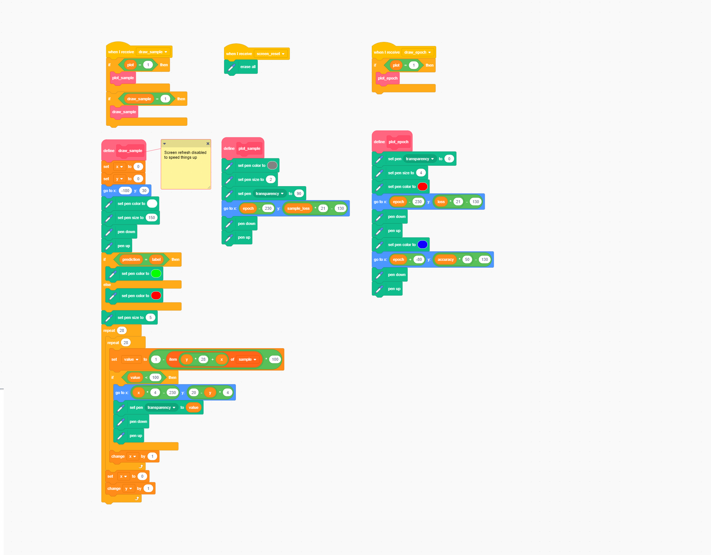

# Info

Implementation of Neural Netowork in Scratch.

This project is strictly related to the book - Neural Networks from Scratch in Python (https://nnfs.io) and is also a form of a joke for April Fool's Day.

Model includes 2 hidden (Dense) layers, 8 neurons each, ReLU activation functions, 10 neurons in output (Dense) layer with Softmax activation function, Cross-entropy loss, calculating of an accuracy, and full backward pass including derivatives, and loss minimization  using backpropagation and simple SGD optimizer.

Helper code allows to draw any MNIST sample during training and prediction, then allow to interact with the model.

Project includes aldo a Python script to create training data and 3 ready to use files containing training datasets.

# Running the model

To run the model first load the project in Scratch, then on the left, under lists' section, check `Mnist` variable to show it in the monitor (small window in upper-right corner of application window). Next right click on the `Mnist` list in the monitor window, select `Import` and choose one of the files. Uncheck `Mnist` to remove it from the monitor and click of a green flag to start training.

To reset a model press `9` and load training data again.

# Dataset

For video purposes I used a set of 100 samples of MNIST dataset. I understand that model probably overfits, but generalization was not the goal of this project, at least at this stage. Project also includes 2 other, bigger sets of samples that are ready to use (import).

# Training process

Because of Scratch restrictions, mostly inability to pass lists as function variables and create 2D and 3D arrays (fast enough ones), many parts of the code (blocks) might look like repeated for no good reason. The same problems limit forward pass as we are passing one sample at a time only, then backpropagation as we do not store gradients and update weights and biases using partial derivatives as we calculate them (so during backpropagation process). Since we're not using batches, training process is slower. 100 epochs might look like a lot, but we are fitting samples one by one, using simple SGD optimizer (there are no momentum for example) and very small model.

# Media

Video showing off the project: 

Video of full training process at x1 speed: 

Most of the model was also saved in a form of following images:

